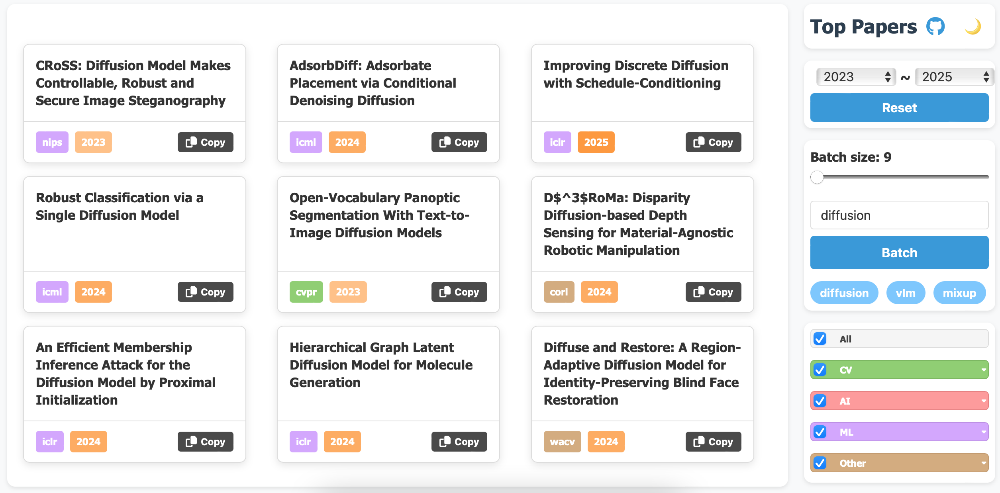

# Sample a Batch of Papers of Top Conferences

### Usage

https://tian-2024.github.io/top-papers/

steps:
1. input a topic, e.g. "diffusion"
2. click "Batch"
3. see 9 papers
4. click "Batch" again to sample another batch

Feature:
- [x] search papers by topic
- [x] sample 9 to 18 papers at a time
- [x] filter papers by conference, field, year
- [x] dark mode to protect your eyes
- [x] support mobile

Supported conferences:
| Field | Conferences |
|-------|-------------|
| **CV** | CVPR, ICCV, ECCV |
| **AI** | AAAI, IJCAI, ACMMM |
| **ML** | NeurIPS, ICML, ICLR |
| **Other** | EMNLP, CORL, SIGGRAPH, SIGGRAPH ASIA, AISTATS, COLM |

### Note

Because github pages only support for static website, more complex features may be hard to implement.

But I think the basic search function for related topics is already quite useful.

### Acknowledgement

The data source is borrowed from [papercopilot](https://github.com/papercopilot/paperlists).

